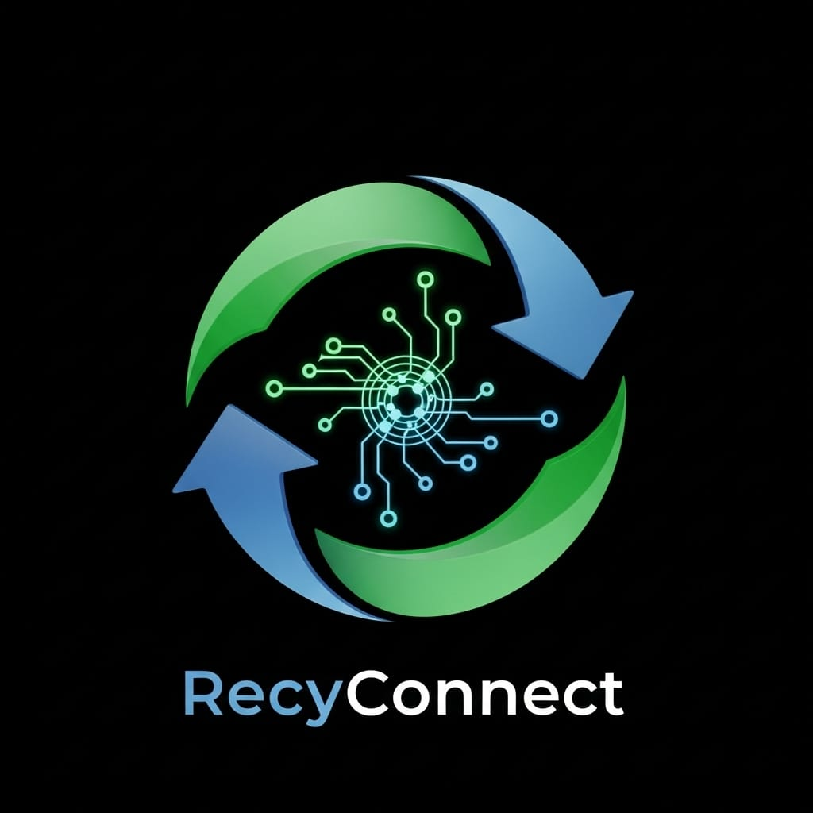

<div align="center">
  
  <h1>♻️ RecyConnect Mobile</h1>
  <p><strong>A Next-Generation Sustainable Waste Management & Recycling Platform</strong></p>

  [](https://flutter.dev/)
  [](https://dart.dev/)
  [](#)
  [](#)
</div>

---

## 📖 Overview

**RecyConnect** is a state-of-the-art Flutter mobile application designed to bridge the gap between individual recyclers, warehouses, and enterprise recycling companies. It provides a robust, gamified marketplace for buying and selling recyclable materials while leveraging cutting-edge on-device AI for material classification.

---

## ✨ Key Features

### 🏢 Multi-Tier Architecture
- **Individual Users:** Sell personal recyclables, track environmental impact, and earn eco-points.
- **Warehouse Managers:** Handle bulk inventory, manage logistics, and procure from individuals.
- **Enterprise Companies:** Monitor corporate sustainability metrics and purchase industrial-scale materials.
- **Admin Dashboard:** System analytics, user moderation, and comprehensive activity logging.

### 🧠 Smart AI Integration
- **On-Device TFLite Classification:** Instantly classify materials (Plastic, Metal, Paper, E-Waste) using an offline Edge AI model.
- **OCR Document Scanning:** Seamlessly scan receipts and invoices using Google ML Kit.

### 💸 FinTech Capabilities
- **Stripe Integration:** Secure, instant transactions for buying and selling bulk materials in the marketplace.
- **Financial Dashboards:** Interactive charts and earning reports powered by `fl_chart`.

### 🎨 Premium UI/UX Design
- **Glassmorphism:** Modern, frosted-glass aesthetics with soft shadows ensuring a premium feel.
- **Dynamic Theming:** Deeply integrated Light and Dark modes with dynamic color palettes based on materials.
- **Micro-Animations:** Fluid transitions, hero animations, and staggered lists utilizing `flutter_animate` and Lottie.

---

## 🛠 Technology Stack

### Core Framework
* **Flutter** (UI Toolkit)
* **Dart** (Programming Language)

### Major Packages
* **State Management:** `provider`
* **Networking:** `dio`, `http`, `connectivity_plus`
* **Local Storage:** `hive`, `flutter_secure_storage`, `shared_preferences`
* **Machine Learning:** `tflite_flutter`, `google_mlkit_text_recognition`
* **Payments:** `flutter_stripe`
* **Location:** `geolocator`, `geocoding`
* **UI/UX:** `flutter_animate`, `glassmorphism`, `fl_chart`, `shimmer`

---

## 📸 Screenshots
<div align="center">
  
  &nbsp;&nbsp;&nbsp;&nbsp;
  
</div>

*(Note: Make sure `flutter_01.png` and `flutter_02.png` reflect the latest UI)*

---

## 🚀 Getting Started

### Prerequisites
Before you begin, ensure you have the following installed:
- [Flutter SDK](https://flutter.dev/docs/get-started/install) (v3.0.0 or higher)
- Android Studio / VS Code
- Git

### 1. Clone the Repository
```bash
git clone <repository-url>
cd RecyConnect-frontend
```

### 2. Install Dependencies
```bash
flutter pub get
```

### 3. Environment Configuration
The app uses `--dart-define` for secure compile-time environment variables.

**For Local Development:**
```bash
flutter run --dart-define=API_URL=http://YOUR_LOCAL_IP:5000/api
```
*(Make sure your backend is listening on `0.0.0.0` and both your development machine and test device share the same Wi-Fi network).*

**For Production Build:**
```bash
flutter build apk --release \
  --dart-define=API_URL=https://your-production-api.com/api \
  --dart-define=STRIPE_PUBLISHABLE_KEY=pk_live_xxxxxx
```

---

## 🏗 Project Structure

```text
lib/
├── core/
│   ├── constants/         # App constants, Configs, API endpoints
│   ├── models/            # Data transfer objects
│   ├── services/          # Business logic, networking, external APIs
│   ├── theme/             # Design system (Colors, Typography, Themes)
│   └── utils/             # Helper functions and extensions
├── presentation/
│   ├── screens/           # Feature-based UI screens
│   │   ├── auth/          # Authentication flows
│   │   ├── dashboard/     # Role-specific dashboards
│   │   ├── marketplace/   # Item browsing and details
│   │   └── ...
│   └── widgets/           # Highly reusable UI components
└── main.dart              # App entry point & dependency injection
```

---

## 🧪 Testing

We ensure code reliability through comprehensive testing.
```bash
# Run all unit and widget tests
flutter test

# Generate coverage report
flutter test --coverage
genhtml coverage/lcov.info -o coverage/html
open coverage/html/index.html
```

---

## 📦 Deployment Pipeline

### Android (Play Store)
1. Configure your release keystore in `android/key.properties`.
2. Generate an App Bundle:
   ```bash
   flutter build appbundle --release --dart-define=API_URL=... --dart-define=STRIPE_PUBLISHABLE_KEY=...
   ```
3. Upload the `.aab` file to the Google Play Console.

### iOS (App Store)
1. Open `ios/Runner.xcworkspace` in Xcode.
2. Setup your provisioning profiles and signing certificates.
3. Archive the build and distribute via TestFlight or the App Store.

---

## 🛡 Security Practices
* **Zero Hardcoded Secrets:** All sensitive API keys and URLs are injected at compile-time via `--dart-define`.
* **Encrypted Storage:** JWTs and authentication states are secured using `flutter_secure_storage`.
* **HTTPS Protocol:** Strict enforcement of secure transport for all network communications.
* **Granular Permissions:** Clean manifest declarations for Camera, Location, and Storage access.

---

<div align="center">
  <p>Built with ❤️ by the RecyConnect Team.</p>
</div>
